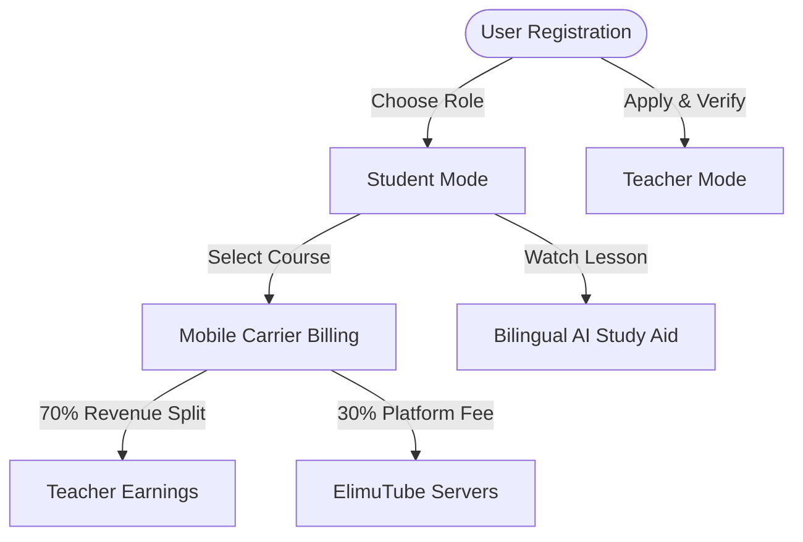

# ElimuTube: User-Centered Product Experience

Welcome to **ElimuTube**, Tanzania's independent digital learning ecosystem designed to connect passionate, verified teachers (**Walimu Bingwa**) with students seeking curriculum-aligned video resources.

This guide outlines our user experience philosophy, explaining *what* we are building, *how* it helps our users, and how the technical architecture supports their everyday learning journey.

---

## 👥 User Roles & Journeys

ElimuTube serves three primary users, each with a tailored experience:

### 1. 🎓 The Tanzanian Student (*Mwanafunzi*)

#### The Problem
Students preparing for national NECTA exams (Form I–VI, Standard 1–7) face a lack of structured digital study guides. Expensive tutoring is out of reach for many, and credit-card checkouts on foreign platforms are impossible for households without credit cards. High bandwidth costs also drain mobile data limits quickly.

#### The ElimuTube Experience
*   **Curriculum-Aligned Search:** Browse lessons mapped directly to the NECTA and CSEE syllabi. Finding Form IV Biology or Form III Mathematics takes seconds.
*   **Mobile-First Carrier Billing:** Students subscribe to premium teachers using secure local mobile wallets (Vodacom M-Pesa, Airtel Money, Tigo Pesa). The checkout uses a standard network push—no credit cards required.
*   **Low-Bandwidth Adaptive Streaming:** Videos adjust their bitrate automatically to avoid buffering and save mobile data packages, ensuring rural students can participate.
*   **Bilingual AI Study Assistant:** Under each lesson, students toggle between Kiswahili and English to read AI-generated transcripts, summaries, and core formula cheatsheets to accelerate revision.
*   **Interactive Live Classrooms:** Wanafunzi can join scheduled live reviews and submit questions via real-time WebRTC chat directly to the teacher.

---

### 2. 👩‍🏫 The Tanzanian Teacher (*Mwalimu Bingwa*)

#### The Problem
Unemployed or underemployed educators across Tanzania struggle to monetize their knowledge. Setting up standalone websites is too complex, and global video sharing platforms require thousands of hours of watch-time before paying pennies.

#### The ElimuTube Experience
*   **Direct-to-Teacher Economics:** We support teachers with a **70% revenue split**. When a student pays a subscription fee, the educator receives 70% directly into their mobile wallet, with the remaining 30% maintaining platform servers.
*   **Simple Upload Portal:** Teachers use a web-based dashboard to upload videos and upload supporting PDF notes.
*   **AI Lesson Generator:** With one click, the platform translates titles, transcribes audio, and creates quiz questions automatically to save preparation time.
*   **Transparent Earnings Ledger:** The dashboard lists active subscribers, monthly watch minutes, and pending payouts deposited on the 5th of each month.

---

### 3. 🛠️ The System Developer & Operator

#### The Problem
Historically, educational applications used separate student and teacher apps, which doubled maintenance overhead and confused users who wanted to study *and* teach.

#### The ElimuTube Experience
*   **Unified Interface Shell:** One app code base containing a secure, client-side role switcher. Users switch between Student and Teacher modes within their profile, maintaining a single authentication session.
*   **Decoupled Frontend & Backend:** Next.js and Flutter frontends interface with a production NestJS backend deployed on Railway, ensuring rapid load times and data persistence.

---

## 🎨 Visual Identity & Brand Colors

The ElimuTube interface uses a curated, premium color system designed to feel warm, engaging, and professional:

| Mode | Token | Value (HEX) | Use Case |
| :--- | :--- | :--- | :--- |
| **Light** | `--primary` | `#E05B13` | Vivid Brand Orange for active icons, buttons, and badges. |
| | `--background` | `#FAF9F6` | Creamy white background for paper-like reading comfort. |
| | `--foreground` | `#232323` | Dark charcoal text for high-contrast accessibility. |
| **Dark** | `--primary` | `#F59E0B` | Bright Amber accent to stand out against dark backdrops. |
| | `--background` | `#0C0E14` | Deep space-indigo background. |
| | `--card` | `#11141E` | Elevated slate card containers. |

---

## 🔒 Verification & Compliance Notice

> [!IMPORTANT]
> **Gateway Integration Architecture**
> ElimuTube is built using open standard WebRTC media streaming protocols and generic mobile network carrier menus to ensure high-performance audio and secure payments. We are not officially associated with, sponsored by, or partner-affiliated with Selcom, Vodacom, Airtel, Tigo, or Agora.io. All brands are property of their respective owners.
